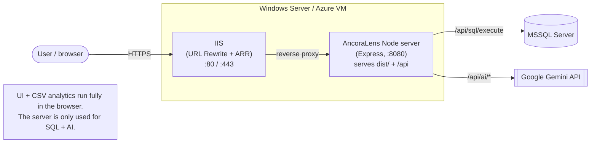
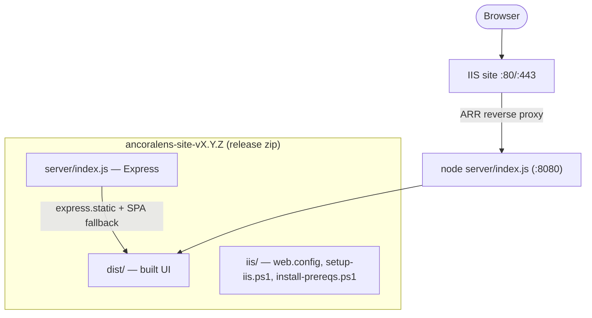
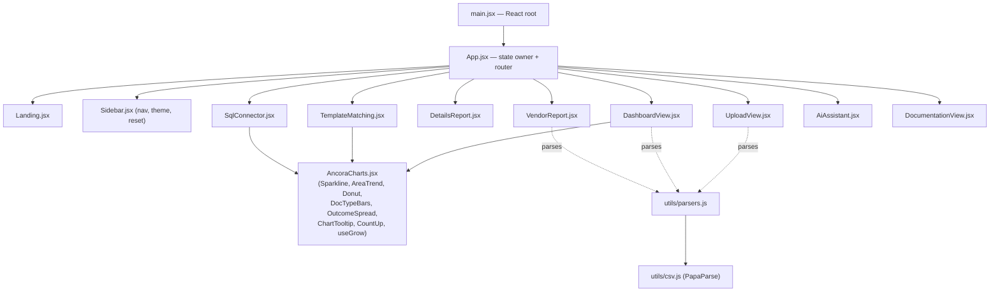
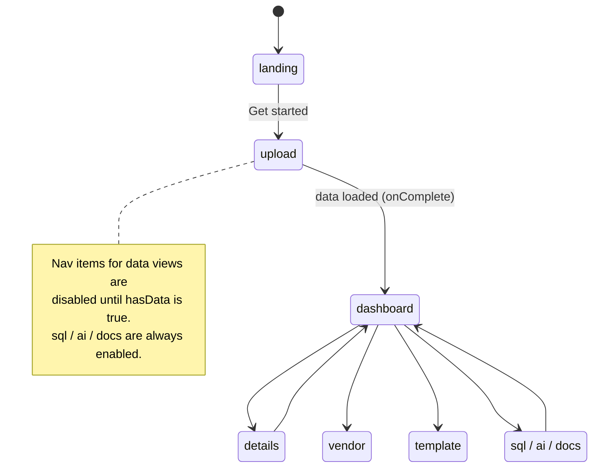
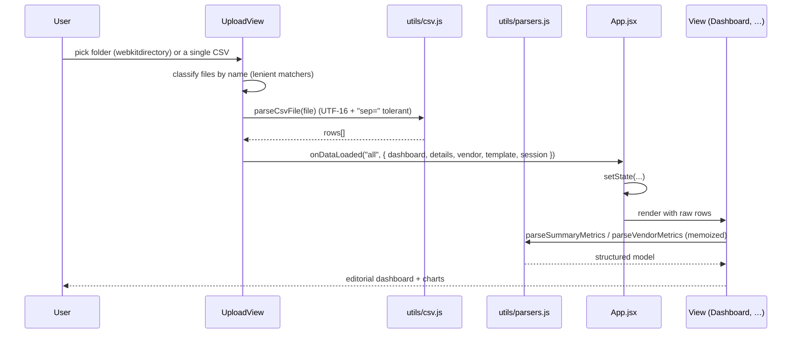

# AncoraLens — Architecture & Engineering Guide

> Onboarding doc for engineers new to this codebase. It explains what the app does,
> how it's structured, how data flows, and how it's built and deployed. Pair this with
> the in‑app **Documentation** page (field‑status glossary) and **`DEPLOY_IIS.md`**.

---

## 1. What it is

**AncoraLens** is a single‑page web app for auditing the accuracy of an **intelligent
document‑processing pipeline**. Users upload the CSV reports produced by that pipeline
(per‑pass summary metrics, a detailed field‑level report, vendor accuracy, and template
matching) and the app turns them into dashboards, drill‑down tables, an SQL console, and
a Gemini‑powered AI assistant.

Two important properties:

- **CSV parsing happens entirely in the browser** (PapaParse). No data is uploaded to a
  server for the analytics views.
- A small **Node/Express server** exists only for two optional, network‑dependent
  features — the **SQL Connector** (MSSQL) and the **AI Assistant** (Google Gemini) — and,
  in production, to **serve the built frontend** on the same port.

### Tech stack

| Layer | Tech |
|---|---|
| UI | React 19, Vite 7 |
| Charts | Bespoke animated SVG (`AncoraCharts.jsx`) + Recharts 3 |
| Motion | framer‑motion + custom `requestAnimationFrame` + `IntersectionObserver` reveals |
| CSV | PapaParse |
| Icons | lucide‑react |
| Server | Express 5, `mssql` (tedious), `@google/generative-ai` |
| Build/Deploy | Vite build → unified Node server → IIS reverse proxy (Windows Server) |

---

## 2. System context



- The **frontend** (built `dist/`) does all CSV parsing and rendering client‑side.
- The **server** is hit only for `/api/sql/*` and `/api/ai/*`. API keys and SQL
  connection strings are entered per‑request in the UI and **never stored server‑side**.

---

## 3. Deployment topology

The whole site ships as **one Node process** serving both the static UI and the API on a
single port. IIS sits in front for TLS / hostname / public port. See `DEPLOY_IIS.md`.



- **Build artifact:** `npm run package` → `release/ancoralens-site-vX.Y.Z.zip`
  (built UI + server + runtime `package.json`/lockfile + IIS configs + deploy guide).
- **Dev vs prod port:** server reads `PORT` (defaults to `3001`; deploy scripts set `8080`).
- **Why reverse proxy and not iisnode:** keeps the Node app unmodified and avoids
  ESM/Express‑5 quirks. `iis/web.iisnode.config` is provided as an alternative.

---

## 4. Frontend structure



`App.jsx` is the single source of truth: it holds all parsed datasets + session info and
conditionally renders one view at a time. There is **no router library**; navigation is a
`activeView` string.

### View state machine



### App state (in `App.jsx`)

| State | Purpose |
|---|---|
| `activeView` | which view renders (`landing`/`upload`/`dashboard`/`details`/`vendor`/`template`/`sql`/`ai`/`docs`) |
| `theme` | `light`/`dark`; applied via `data-theme` on `<html>` |
| `dashboardData` | raw summary CSV rows |
| `detailsData` | raw detailed‑report CSV rows |
| `vendorData` | raw vendor CSV rows |
| `templateData` | **parsed** template‑matching model (or `{error}`) |
| `sessionInfo` | `{ clientName, version, source:{ name, fileCount, kind } }` — drives the sidebar title and the dashboard's data‑source chip |
| `viewMemory` | per‑view UI state (filters, expansion, page) persisted to `sessionStorage` |

`hasData = dashboardData || detailsData || vendorData || templateData`.

---

## 5. Data flow: upload → parse → render



### File classification (folder auto‑load)

`UploadView.loadFolder` is intentionally **lenient** (real exports vary in naming and use
subfolders; `webkitdirectory` includes nested files):

| Dataset | Matched by (filename, case‑insensitive) |
|---|---|
| Summary / metrics → `dashboardData` | prefers `*summary*`, falls back to `*trainingpass*` |
| Detailed report → `detailsData` | `*flatreportdata*` **excluding** `*regiontemplate*` |
| Vendor → `vendorData` | `*vendor*` (prefers `*report*`, else `*low_overall_accuracy*`) |
| Template matching → `templateData` | `*template*` or `*region*` |
| Session | `info.txt` (line 1 = client, line 2 = version); folder name from `webkitRelativePath` |

> ⚠️ Ordering matters: the summary matcher **prefers `*Summary*`** so a per‑pass
> `TrainingPass0.csv` doesn't shadow the multi‑pass summary that contains the
> training‑pass breakdown. (Regression fixed — keep this priority.)

---

## 6. Data model (parsed structures)

`utils/parsers.js` is the heart of the analytics. Key exports:

| Function | Input | Output |
|---|---|---|
| `parseSummaryMetrics(summaryRows, detailRows)` | summary + detail CSV rows | `{ groups, timelineData, docTypeData }` |
| `parseVendorMetrics(rows)` | vendor CSV rows | `Vendor[]` or `{ error }` |
| `parseTemplateMatching(rows)` | template CSV rows | `{ summary, batches, templates, raw }` or `{ error }` |
| `buildDetailModel(rows)` | detail CSV rows | `{ allColumns, trainingPasses, batches, filteredRows }` |
| `statusKind / statusColor / classifyBreakdown` | a status string | semantic class / color / breakdown bucket |

`parseSummaryMetrics().groups`:

```
groups = {
  general:       [{ label, value, numeric?, isPercentage? }]   // batches, docs, pages, accuracy %, pass-through…
  summaryStats:  { total, accuracy, positionAccuracy, breakdown[] }   // header/summary fields
  tableStats:    { total, accuracy, positionAccuracy, breakdown[] }   // table cells (often empty)
  hdrFields:     [{ name, value }]   // header field position accuracy
  liFields:      [{ name, value }]   // line-item field position accuracy
  typeMetrics:   [{ subject, A, fullMark }]   // Text/Date/Money/Decimal (radar)
  trainingPass:  [{ name, fieldAccuracy, totalBatches, exBatches }]
  regionTemplate:[{ label, value }]
}
timelineData = [{ date, count }]   // validation records per date (from detail rows)
docTypeData  = [{ name, value }]   // counts per DocumentType
```

### Field‑status taxonomy

The detailed report's `FieldStatus` column and the summary breakdown buckets are
classified two ways:

- **Keyword class** (`statusKind`): `success` (`correct/valid/match`), `error`
  (`wrong/invalid/missing/fail/incorrect/mismatch`), `warning`
  (`misassign/unknown/unassign/partial/review/skipped`).
- **Breakdown bucket** (`classifyBreakdown`): a value × position matrix — e.g.
  *Correct & Location*, *Correct (Unassigned)*, *Incorrect (Mismatch)*, *Unknown Region*…

The full plain‑English definitions live in the in‑app **Documentation** page
(`DocumentationView.jsx`) — the canonical glossary for error/status types.

---

## 7. Charts & motion system

- **`AncoraCharts.jsx`** — bespoke, dependency‑free animated SVG primitives used by the
  editorial dashboard: `Sparkline`, `AreaTrend`, `DocTypeBars`, `Donut`, `ConfHist`,
  `OutcomeSpread` (100% stacked share bar + list), plus helpers `useGrow` (rAF easing with
  a `setTimeout` safety‑settle for throttled tabs), `CountUp`, and `ChartTooltip`
  (theme‑aware rounded tooltip shared by all Recharts charts).
- **Recharts** powers the deeper "Detailed analytics" charts (bars, radar, area, pies).
- **Scroll‑in animation:** below‑the‑fold charts/gauges animate **when scrolled into
  view**, not on mount. `DashboardView` uses a `useInView` IntersectionObserver hook;
  Recharts charts are wrapped in `RevealChart` (mounts on view, reserving height to avoid
  layout shift); the volume rings/gauges gate their `useAnimatedNumber` on `inView`.

---

## 8. Design system / theming

`src/styles.css` defines the **warm‑paper editorial** language as CSS custom properties,
with stable variable *names* so components inherit theme changes without markup edits.

- **Light (default):** paper `#EFEADD`, ink text, electric‑cobalt accent `#2B3AE8`,
  coral/lime, soft shadows.
- **Dark:** warm‑charcoal re‑map under `[data-theme="dark"]`.
- **Type:** Bricolage Grotesque (display) · Hanken Grotesk (UI) · JetBrains Mono (IDs/code).
- Design‑system aliases (`--paper/--card/--ink/--blue/--r-lg/--display…`) resolve to the
  themed tokens so the editorial layout primitives (`.hero`, `.kpi`, `.panel`, `.tbl`,
  `.grid.cols-12`, `.data-source`, `.docs-*`, `.spread`) work in both themes.

---

## 9. Backend API

`server/index.js` (Express). All endpoints accept/return JSON.

| Method/Path | Purpose | Notes |
|---|---|---|
| `GET /api/health` | liveness check | `{ status:"ok" }` |
| `POST /api/ai/test` | validate a Gemini key | body `{ apiKey, model }` |
| `POST /api/ai/chat` | grounded chat | body `{ apiKey, message, dataContext, history, model }` |
| `POST /api/sql/execute` | run MSSQL query | body `{ connectionString, query }`; blocks `DROP DATABASE`/`SHUTDOWN` |
| `GET *` (non‑`/api`) | SPA fallback → `dist/index.html` | only when `dist/` is present |

- **Dev:** `vite.config.js` proxies `/api` → `http://localhost:3001`, so the frontend
  always calls same‑origin relative `/api` (`VITE_API_BASE_URL` defaults to `""`).
- **Security:** the SQL Connector runs arbitrary SQL from the browser — deploy behind
  auth / a trusted network with a least‑privilege login.

---

## 10. Graceful degradation ("be tolerant")

Real exports are often partial. The app never fabricates metrics:

- The folder loader loads whatever it can find and ignores unrecognized files.
- Missing metrics render **"insufficient data"** instead of `0`/`NaN` (e.g., Table Cells,
  Total Tables, KPI cards via an `available` flag, the pipeline donut).
- Pages with no usable data (**Template Matching**, **Vendor Analysis**) show a soft
  **"Limited data — could not be loaded due to insufficient data"** warning while the rest
  of the dashboard keeps working.

---

## 11. Module reference

| Path | Responsibility |
|---|---|
| `index.html` | HTML host; loads Google Fonts + `/src/main.jsx` |
| `src/main.jsx` | React root mount |
| `src/App.jsx` | State owner + view router; `handleDataLoaded`, `resetSession`, `viewMemory` |
| `src/components/Landing.jsx` | Editorial landing / entry screen |
| `src/components/Sidebar.jsx` | Left nav, theme toggle, reset, session/brand title |
| `src/components/UploadView.jsx` | Folder auto‑load + 4 single‑file inputs; file classification; source capture |
| `src/components/DashboardView.jsx` | Editorial overview (hero, KPIs, signature charts) + full Recharts analytics; in‑view animation |
| `src/components/DetailsReport.jsx` | Dense field‑level table: filters, search, columns, pagination, batch/line‑item trees, export |
| `src/components/VendorReport.jsx` | Vendor table: KPI row, column sorting, expandable per‑vendor detail |
| `src/components/TemplateMatching.jsx` | Coverage donut + usage chart + windowed/memoized batch→doc→page accordion |
| `src/components/SqlConnector.jsx` | MSSQL connection form + query editor + results/export |
| `src/components/AiAssistant.jsx` | Gemini chat (key/model in localStorage), grounded with report context |
| `src/components/DocumentationView.jsx` | Searchable field‑status reference (the glossary) |
| `src/components/AncoraCharts.jsx` | Bespoke SVG chart primitives + hooks + shared tooltip |
| `src/utils/csv.js` | PapaParse wrappers (UTF‑16 / BOM / `sep=` tolerant), CSV export |
| `src/utils/parsers.js` | All report parsers + status taxonomy |
| `server/index.js` | Express server: static UI + SQL/AI API |
| `vite.config.js` | Vite config + dev `/api` proxy |
| `scripts/package.mjs` | Build + assemble + zip the deploy bundle |
| `iis/*`, `DEPLOY_IIS.md`, `DEPLOY_AZURE_VM.md` | Windows/IIS deployment |

---

## 12. Local development

```bash
npm install

# Frontend (Vite dev server, HMR) — http://localhost:5173
npm run dev

# Backend (only needed for SQL Connector / AI Assistant) — http://localhost:3001
npm run server        # node server/index.js
```

- Load data via **Upload Data → Auto‑Load from Folder** (a results export folder) or the
  individual CSV tiles.
- **Production build + run on one port:** `npm run start:prod` (build then serve `dist/`).
- **Package for handoff:** `npm run package` → `release/ancoralens-site-vX.Y.Z.zip`.

> Note: this is a JS (not TS) React project. Keep `.ps1`/config files **ASCII‑only** — the
> deploy scripts run under Windows PowerShell 5.1, which mis‑reads non‑ASCII in BOM‑less files.
```
